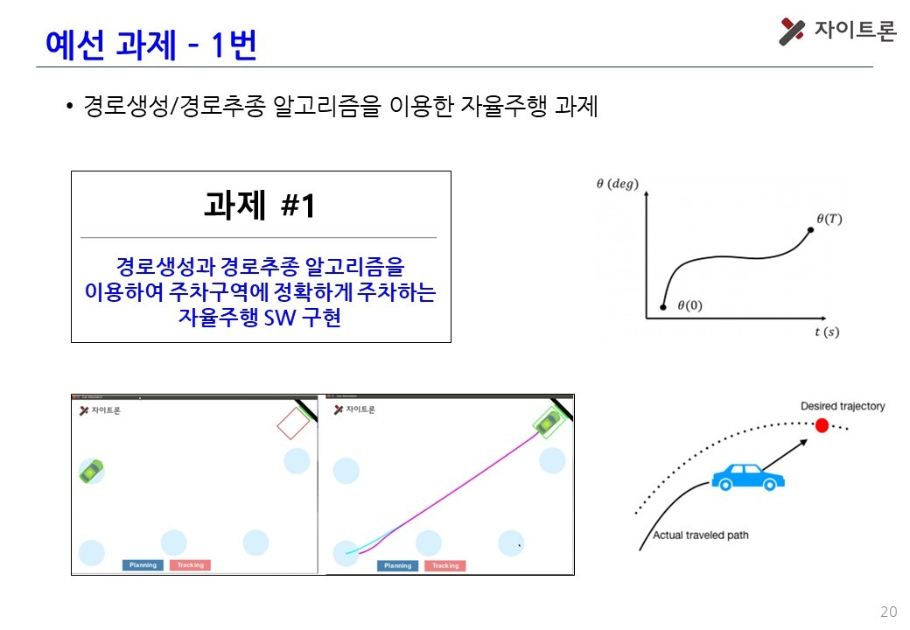

# 제7회 국민대학교 자율주행 경진대회 예선 과제1

## Task
- 경로생성과 경로추종 알고리즘을 이용하여 주차구역에 정확하게 주차하는 자율주행 SW 구현   
<br/>



## 실행 영상
<br/>


## Method
**경로생성**
- Dubins Algorithms
  
<br/>

**경로추종**
- 속도 제어: PID
- 조향각 제어: Pure Pursuit


## Installation

``` bash
$ cd ~/
$ git clone https://github.com/sangmyung-hwansoo-competitions/qualifying1.git
$ cd qualifying1
$ sudo ./build_container_ubuntu.sh
```

## Usage

``` bash
$ sudo docker exec -it q1 bash
$ roslaunch assignment_1 parking.launch
```
